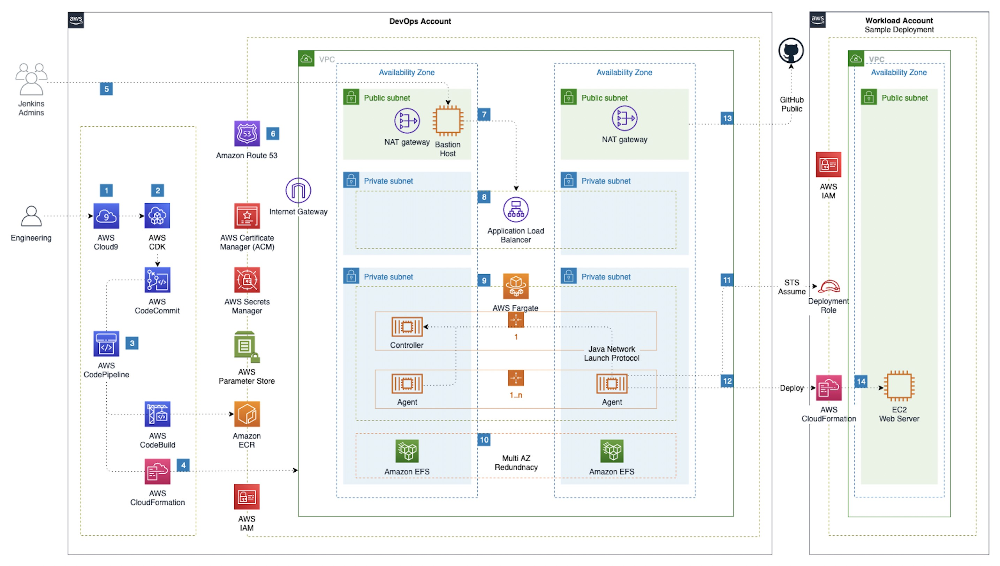
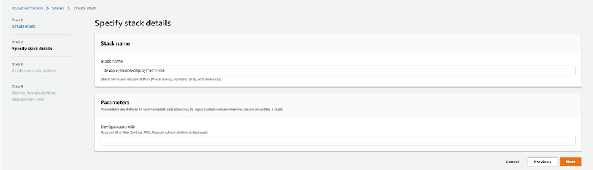
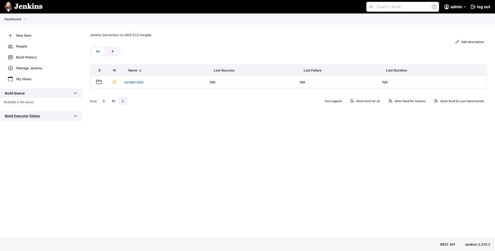
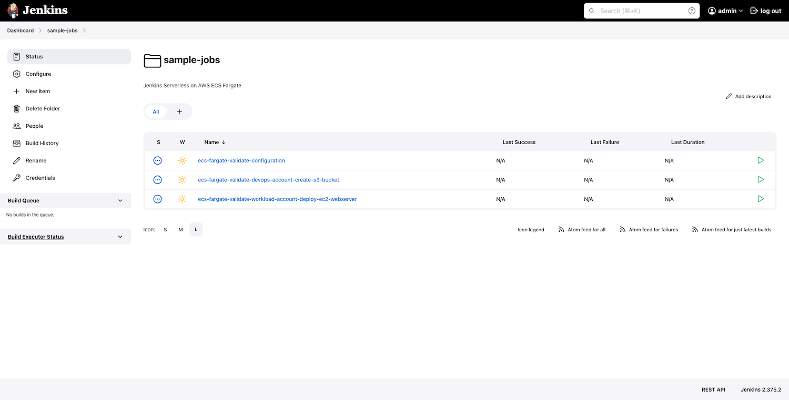

## Build and Deploy Jenkins as code to ECS Fargate using AWS CDK.

## Overview
Leverage AWS services Amazon Elastic Container Service (ECS), Amazon Elastic Container Registry (ECR), AWS Certificate Manager, AWS Private Certificate Authority, Amazon Route 53, AWS CodePipeline, AWS CodeCommit, AWS CodeBuild and AWS CDK to deploy highly available and fault tolerant Jenkins Controller and Agent Infrastructure as Code (IaC) and build out a CI/CD pipeline for deploying changes to Jenkins Infrastructure. We will build custom Jenkins Controller and Agent images with the necessary plugins and configurations and leverage Jenkins Configuration as Code to build and push custom images to ECR for both Controller and Agent. We will also deploy a deployment role into a workload account that will allow Jenkins to deploy cloudformation stack to demonstrate cross account deployment using Jenkins.

## Architecture



## Repository Structure
- jenkins - Jenkins build and configurations. For more details review the [README](jenkins/README.md)
- cdk - AWS CDK Project for Building and Deploying Jenkins to ECS Fargate. For more details review the [README](cdk/README.md)

## Configure Development Environment
- Follow the steps in the Cloud9 Environment Setup guide - [Setup-Cloud9-Environment](SETUP-CLOUD9.md)

## Environment Setup and Local Testing

1. Setup and Install Typescript:
    ```bash
    cd ${HOME}/environment
    npm install -g typescript
    export CDK_DEFAULT_ACCOUNT=$(aws sts get-caller-identity --output text --query Account)
    export CDK_DEFAULT_REGION=$(curl -s 169.254.169.254/latest/dynamic/instance-identity/document | jq -r '.region') 
    ```

2. Bootstrap AWS CDK:
    ```bash
    cdk bootstrap aws://$CDK_DEFAULT_ACCOUNT/$CDK_DEFAULT_REGION
    ```

3. Clone the source code repository from aws-samples:
    ```bash
    cd ~/environment
    git clone https://github.com/aws-samples/aws-jenkins-ecs-cdk.git                    
    ```

4. Setup Git User:
    ```
    git config --global user.name "workshop-admin"
    git config --global user.email "workshop-admin@example.com"
    ```

5. NPM Install:
    ```
    cd ~/environment/aws-jenkins-ecs-cdk/cdk
    npm install @types/node
    ```

## Create Private CA using AWS Private Certificate Authority.
- CDK Stack will deploy a private hosted zone and an internal ALB. Jenkins will be backed by an ALB that will be accessible from only within the VPC through a Bastion Host. ALB Certificate will be issued through ACM through a Private Certificate Authority. 
- Follow the steps in the Private CA Setup guide to complete the Private CA setup - [Setup Private CA](SETUP-PRIVATECA.md)

## Build the infrastructure and pipeline using AWS CDK and validate the Jenkins application.

**Note:** This workshop will create chargeable resources in your account. When finished, please make sure you clean up resources as instructed at the end.

1. Please review [README](cdk/README.md) for the default values that are used from cdk.json. 

2. Current default for **ctxHostedZoneName** is set to **internal.anycompany.com**. Update **ctxHostedZoneName** with appropriate value in the **cdk.json** file and this needs to align with the Private CA configuration.  Please review the default values for remaining parameters and update as needed. 
 
3. Set up DockerHub Credentials in Secrets Manager for Docker Login credentials. Please provide your personal docker username (not email) and password. 
    ```bash
    aws secretsmanager create-secret \
        --name dockerhub_credentials \
        --description "DockerHub Credentials" \
        --secret-string "{\"username\":\"dockerhub_username\",\"password\":\"dockerhub_password\"}" \
        --region=$CDK_DEFAULT_REGION
    ```

4. Set up Jenkins Admin Credentials in Secrets Manager for Jenkins Login credentials. Please provide jenkins username (e.g. admin) and password. 
    ```bash
    aws secretsmanager create-secret \
        --name "/dev/jenkins/admin/credentials" \
        --description "Jenkins Dev Admin User Credentials" \
        --secret-string "{\"username\":\"jenkins_username\",\"password\":\"jenkins_password\"}" \
        --region=$CDK_DEFAULT_REGION
    ```
**Note** Update values for **ctxJenkinsAdminCredentialSecretName** and **ctxDevTeam1Workload1AWSAccountIdParameterName** in **cdk.json** if you do override the secret names in step 4 and 5 above. 

5. Please identify the **workload** account to allow Jenkins from **DevOps** account to deploy to and run the following command. 
    ```bash
    aws ssm put-parameter \
    --name "/dev/team1/workload1/AWSAccountID" \
    --value "<PROVIDE-WORKLOAD-AWSACCOUNTID>" \
    --type String \
    --region=$CDK_DEFAULT_REGION
    ```

6. Run the CloudFormation template available [here](assets/images/images/cf-jenkins-deployment-role.yaml) in the workload account and provide the **DevOps AWSAccountId**. Please review/update the Jenkins deployment role based on your requirements to limit the role to specific permissions needed for Jenkins Agent.

    

7. Deploy **Step Phase 1**: Create Code Commit Repo
    - Setup the Code Commit Repo. 
        ```bash
        cd ~/environment/aws-jenkins-ecs-cdk/cdk
        cdk deploy
        ```
    - When asked whether you want to proceed with the actions, enter `y`.

        

    - Wait for AWS CDK to complete the deployment before proceeding. It will take few minutes to complete `cdk deploy`. Pipeline will fail since the code is not available in code commit repo.

8. Deploy **Step Phase 2**: Enable CI/CD Pipeline and deploy infrastructure and application.
    - Commit the code and set the origin to the code commit repo that was created.
        ```bash
        cd ~/environment/aws-jenkins-ecs-cdk
        git remote rename origin upstream
        git remote add origin "provide codecommit repo HTTPS URL created in above step"
        git commit -am "Initial Commit"
        git push origin main
        ```
    - Code Commit changes will invoke the Code Pipeline. It will take approximately 10 to 15 minutes to complete the deployment.
    - Initial deployment will take longer since this includes building the container image for controller and agent and setting up the infrastructure that includes Networking, EFS, ECS Cluster and other dependent components.
    - Explore the deployment progress on the CloudFormation console.

9. Follow the steps in the Bastion Host Setup guide to complete the Bastion Host setup - [Bastion Host Setup](SETUP-BASTION-HOST.md) and RDP into the Bastion Host.

10. Validate the Deployment.
    - Access the Jenkins endpoint available at `https://jenkins-dev.internal.anycompany.com`
    - Login using the Jenkins Admin User Credentails that you provided in step 4.

11. Review the deployed stack.
    - View the ECS cluster using the [Amazon ECS console](https://console.aws.amazon.com/ecs).
    - View the ECR repo using the [Amazon ECR console](https://console.aws.amazon.com/ecr).
    - View the EFS using the [Amazon EFS console](https://console.aws.amazon.com/efs).
    - View the CodeCommit repo using the [AWS CodeCommit console](https://console.aws.amazon.com/codecommit).
    - View the CodePipeline using the [AWS CodePipeline console](https://console.aws.amazon.com/codepipeline).
    - View the CloudFormation using the [AWS CloudFormation console](https://console.aws.amazon.com/cloudformation).
    - Review and validate Jenkins application by logging into the Jenkins using admin credentials.
        

12. Review the sample jenkins jobs. The deployment includes three jobs that are configured as code as part of the controller image that is built using the pipeline.

    

    - **ecs-fargate-validate-configuration** - Job to validate the Jenkins deployment and configuration for controller and agent.
    - **ecs-fargate-validate-devops-account-create-s3-bucket** - Job configured to checkout project from GitHub SCM and deploy CloudFormation template to create an S3 bucket in **DevOps** account using Jenkinsfile and pre-configured environment variables.
    - **ecs-fargate-validate-workload-account-deploy-ec2-webserver** - Job configured to checkout project from GitHub and deploy CloudFormation template to create an EC2 instance in **Workload** account to default VPC using Jenkinsfile and pre-configured environment variables.

13. Validate the CI/CD Pipeline.
    - Add a new plugin to the plugins.txt for example **sonar:2.15**
    - Commit the change and push the change to the code commit repo.
        ```bash
        cd ~/environment/aws-jenkins-ecs-cdk
        git commit -am "Added Sonar Plugin"
        git push origin main
        ```
    - Review that the commit started the code pipeline build. It will take approximately 10 minutes to deploy the change which includes building a new Controller image and push the new tag version to Parameter Store. Pipeline should not publish a new agent image, since no changes were made to agent. In order to have more control on ECR repostitory and lifecycle we have avoided the usage of [CDK ECR Asssets](https://docs.aws.amazon.com/cdk/api/v2/docs/aws-cdk-lib.aws_ecr_assets-readme.html). 
    - Image tag versions are stored in SSM parameters only when there is change to the image due to changes in layers to the docker image. SSM parameter also helps with propagating the change to deploy new image only when changed**. Pipeline should also create a new task definition for the Controller and ECS cluster should **deploy the latest version of the Controller since only the Controller image changed during this deployment. 
    - Login using the Jenkins Admin User Credentails and validate the list of installed plugins and you should see SonarQube version 2.15 installed successfully.

14. Cleaning Up.
    - Delete the container images from both controller and agent ECR repositories.
        ```bash
        aws ecr batch-delete-image --region $CDK_DEFAULT_REGION --repository-name jenkins-controller --image-ids "$(aws ecr list-images --repository-name jenkins-controller --region $CDK_DEFAULT_REGION | jq -r '.imageIds')"

        aws ecr batch-delete-image --region $CDK_DEFAULT_REGION --repository-name jenkins-agent --image-ids "$(aws ecr list-images --repository-name jenkins-agent --region $CDK_DEFAULT_REGION | jq -r '.imageIds')"
        ```
    - Delete the Windows Bastion Host stack and wait for completion.
        ```bash
        aws cloudformation delete-stack --stack-name jenkins-bastion-host-stack --region $CDK_DEFAULT_REGION
        aws cloudformation wait stack-delete-complete --stack-name jenkins-bastion-host-stack 
        ```

    - List all the stacks.
        ```
        cd ~/environment/aws-jenkins-ecs-cdk/cdk
        cdk list
        ```
    - Review the list of stacks and run the delete stack for each one. When asked whether you want to proceed with the actions, enter `y`. Wait for AWS CDK to complete the destroy.
        ```
        cdk destroy jenkins-on-ecs-stack/jenkins-iac-dev-deploy/app
        cdk destroy jenkins-on-ecs-stack/jenkins-iac-dev-build-image/ecr
        cdk destroy jenkins-on-ecs-stack
        ```

    - Delete the secrets from Secrets Manager.
        ```bash
        aws secretsmanager delete-secret --secret-id dockerhub_credentials --recovery-window-in-days 7 --region $CDK_DEFAULT_REGION
        aws secretsmanager delete-secret --secret-id "/dev/jenkins/admin/credentials" --recovery-window-in-days 7 --region $CDK_DEFAULT_REGION
        ```
    - Delete the parameters from Parameter Store.
        ```bash
        aws ssm delete-parameter --name "/dev/team1/workload1/AWSAccountID" --region $CDK_DEFAULT_REGION
        aws ssm delete-parameter --name "/dev/jenkins/controller/docker/image/tag" --region $CDK_DEFAULT_REGION
        aws ssm delete-parameter --name "/dev/jenkins/agent/docker/image/tag" --region $CDK_DEFAULT_REGION
        ```

    - Self Signed CA Setup (Default) - Delete the ACM Certificate ARN from parameter store and Root CA from Secrets Manager.
        ```bash
        ACM_CERT_AUTHORITY_ARN=$(aws ssm get-parameter --name "/dev/jenkins/acm/selfSignedCertificateArn" --query "Parameter.Value" --output text --region $CDK_DEFAULT_REGION)
        aws acm delete-certificate --certificate-arn $ACM_CERT_AUTHORITY_ARN --region $CDK_DEFAULT_REGION
        aws ssm delete-parameter --name "/dev/jenkins/acm/selfSignedCertificateArn" --region $CDK_DEFAULT_REGION
        aws secretsmanager delete-secret --secret-id "/dev/jenkins/rootCA" --recovery-window-in-days 7 --region $CDK_DEFAULT_REGION
        ```

    - AWS Private CA Setup - Delete the AWS Private CA and associated parameter from Parameter Store and Root CA from Secrets Manager.
        ```bash
        PCA_CERT_AUTHORITY_ARN=$(aws ssm get-parameter --name "/dev/jenkins/acmpca/pcaAuthorityArn" --query "Parameter.Value" --output text --region $CDK_DEFAULT_REGION)
        aws acm-pca delete-certificate-authority \
            --certificate-authority-arn $PCA_CERT_AUTHORITY_ARN \
            --permanent-deletion-time-in-days 7
            --region $CDK_DEFAULT_REGION
        aws ssm delete-parameter --name "/dev/jenkins/acmpca/pcaAuthorityArn" --region $CDK_DEFAULT_REGION
        aws secretsmanager delete-secret --secret-id "/dev/jenkins/rootCA" --recovery-window-in-days 7 --region $CDK_DEFAULT_REGION
        ```

    - Delete the Cloud9 Instance from AWS Console.

## Security

See [CONTRIBUTING](CONTRIBUTING.md#security-issue-notifications) for more information.

## License

This library is licensed under the MIT-0 License. See the LICENSE file.